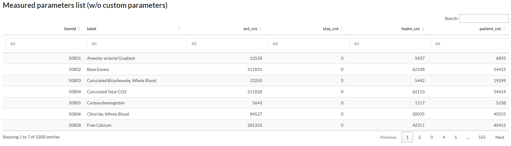
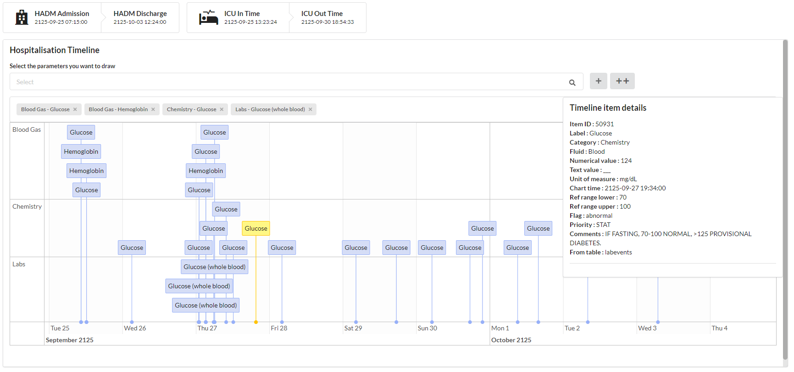
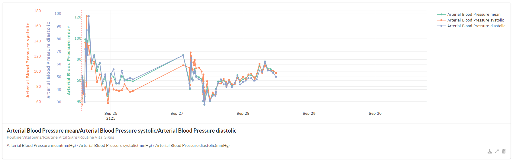
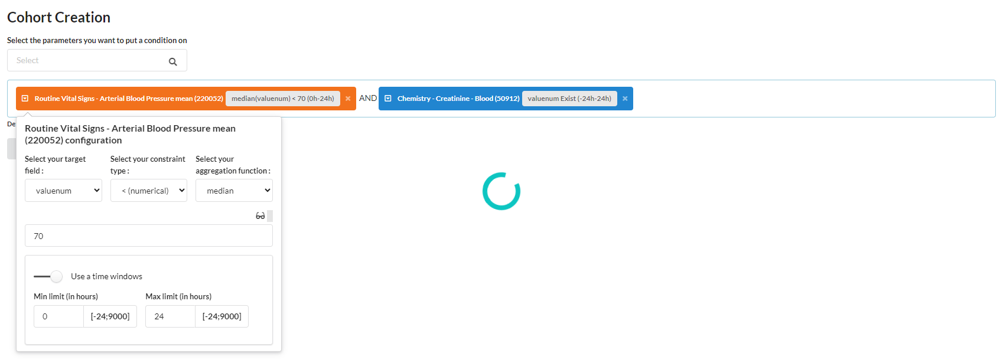
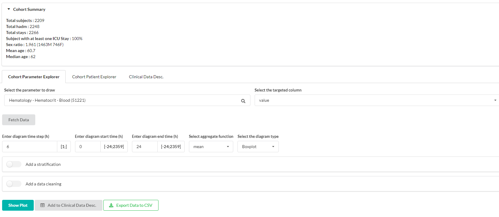
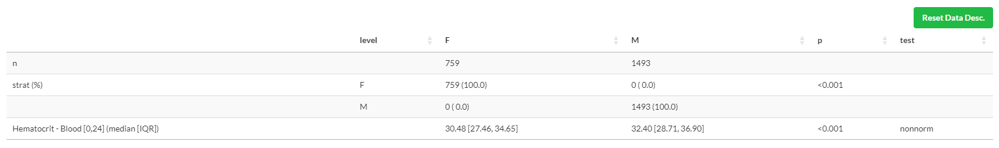
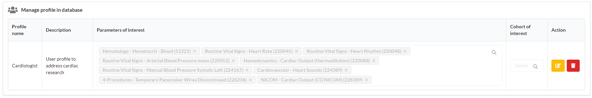

Navigate througth the database
##############################

MIMICWizard is now installed and you're ready for a walkthrought let's discover the application features.

Explore the data (Parameter Exploration)
****************************************

The first tab is used to explore the list of all recorded events in MIMIC-IV database associated with their relative count.

      First page of the parameters list, user can search by label and order by event count 

You can search any event in the database and see if it's efficiently populated in MIMIC or at least find a proxy that could meet 
your needs (:numref:`parameters_explore`). In fact a lots of events/patient data are redundant or splitted in several item and that's the main purpose of this first tab, see how the data is divided in the database.

Discover a patient card (Patient Explorer)
******************************************
Here you can browse all the patient in the database and display all events registered during his hospitalization.

You can choose to select a patient using the classic subject_id > hadm_id > stay_id path to access patient data or directly access a patient stay using the **Direct search with a UID** feature, 
enabling easy reference sharing between user without transmitting a 3 value key to access a patient stay.

Timeline module
+++++++++++++++

      Hospitalization timeline of a patient, displaying glucose and hemoglobin. A glucose measurement is selected and detailled information are shown on the right side.

The timeline is used to represent complex event such as free-text event, event represented as a character or a factor or to go deeper in the data.
It allows an almost complete access to the database row behind this event. 

To add an event type to the timeline, search this event in the bar just above the timeline and click on ``+``. If you cannot find an event on this searchbar, it means that the selected patient haven't any event of this type referenced for the selected hadm/stay.

If a lots of data is stacked at the same time point, it can be summarized by their category name. Then you have to select the item to observe all linked events.

Graph module
++++++++++++

      3 parameters patient graph, displaying Blood Pressure (systolic/diastolic/mean). Each parameters has is own y-axis and scale.

The timeline is used to represent numerical data. It can represent any kind of numerical data, you're the only master who knows if what is displayed make sense.
You can choose to display multiple parameters as shown in :numref:`patient_explorer_graph`.
In order to add several parameters on the same graph, add multiple element on the graph searchbar and click on the ``+`` button. 

*Note that even if your parameters are on the same scale, each parameters has its own y-axis.*

.. tip:: You can use the ``++`` button to add an event both in the timeline and in the graph module

You can also download the data contained in the graph with the dedicated button at the bottom rigth of the graph.

Create a retrospective cohort from MIMIC patients (Cohort creation)
*******************************************************************

      Cohort generation module which is generating a cohort with patient with median value of Blood Pressure < 70 
      during the first 24 hours of the ICU stay and with creatinine measurement taken 24 hours before or after ICU stay start

The cohort generation module help you to create cohort based on event occurence. You can apply a combination of event and restrict on :

- Time condition (relative to the ICU in-time)
- Value
- Aggregated value (min, max, median, mean, sum)

.. hint:: You can use the glasses icon to display a preview of the registered data in the whole database for this event

Once you've fetched your cohort, you can preview some statistics about this fetched cohort.
If theses informations fits your needs, you can persist it to explore it in the cohort explorer tab.

Explore a created cohort
************************

Your cohort is now persisted in the database and you want to explore it, you're at the right place.
You can select the cohort you want to visualize using the selector at the top right of your dashboard. If you cannot see a freshly created cohort, don't hesitate to press the refresh button next to it to import new cohort. 
If you cannot see a cohort and you're not using the default profile, please make sure it's integrated in you cohort profile (`see more about profile <Define your profile to navigate faster_>`_).

The cohort explorer tab is divided in 4 modules : 

- **Cohort outcomes explorer** : explore the outcomes of your cohort, such as mortality, length of stay, etc.
- **Cohort parameter explorer** : explore the evolution of an event of interest in the database
- **Cohort patient explorer** : explore each individual patient in the selected cohort
- **Clinical data desc.** : get some detailled statistics about multiple selected parameters in your cohort.

Cohort outcomes explorer
+++++++++++++++++++++++++

The cohort outcomes explorer tab is used to explore the outcomes of your cohort. 
It can be used to observe the mortality rate, length of stay, and other statistics about your cohort.
You can also, at the bottom of the page stratify your cohort to observe differences between up-to 6 subgroups.

.. list-table::
   :widths: 50 50
   :header-rows: 0

   * - .. figure:: assets/cohort_outcomes_table.png
          :width: 100%
          :class: no-scaled-link

          Cohort outcomes table summarizing the cohort outcomes, statistics and p-value when cohort is stratified

     - .. figure:: assets/cohort_outcomes_graph.png
          :width: 100%
          :class: no-scaled-link

          Visualize cohort outcomes with graphs

Cohort parameter explorer
+++++++++++++++++++++++++

      Cohort parameter explorer tab with several setting to plot a specific event summary in the cohort

Cohort parameter explorer tab offer you the possibilitiy to draw 3 types of plot to summarize a specific event in your cohort.

- Boxplot
- Violin plot
- Longitudinal trajectory (median/Q1-Q3)

You can choose how which time range to observe and how data should be aggregated for a patient in a time step *(min, max, median, mean, sum)*.
From this panel, you can also **send data in the clinical desc. module** to get a statistical overview of your parameter.

Sub-stratify a cohort
=====================

Using the "Add a stratification" panel you can choose to separate your cohort into 2 subgroup to observe differences.

The stratification panel offer 2 differents stratification model, the first one is based on demographic data and the second one one the same model as the cohort creation module.

+--------------------------------------+
| Demographic parameters               |
+======================================+
| Gender                               |
+--------------------------------------+
| Age                                  |
+--------------------------------------+
| Hospitalization length (in days)     |
+--------------------------------------+
| In hospital death                    |
+--------------------------------------+
| Death <1 years after hospitalization |
+--------------------------------------+

*Table : List of available demographics restriction in cohort stratification panel*

Removing outliers
=================

You can restrict the data you want to see in your plot using the fast data quality control tool provided integrated in the app. It do not allow 
complex restriction but help to remove inconsistent stay or data to draw nice plot, getting rid of abnormal data.

Cohort patient explorer
+++++++++++++++++++++++

You can access to each patient of the cohort to explore specific case individualy when needed. 
This module is based on the `patient explorer module <Discover a patient card (Patient Explorer)_>`_.

Clinical data desc.
+++++++++++++++++++

      Clinical data description on an example cohort highlighting the difference of hematocrit in blood during the first 24h of an ICU stay

From the cohort parameter explorer tab, you can send data to this module using the ``Add to Clinical Desc.`` button.
Please do not consider the statistics tests (and associated p-value) that you could see here as "Truth". 
These are programmaticaly generated by the *tableone* package.
Statistic residuals standardizartion and other statistical restriction could not be complied. 

.. warning:: Use this module as descriptive, as statistical tests could be biased. This tab should be used to give you hint and further data scientist work need to be made before drawing any conclusion

Define your profile to navigate faster
**************************************

In order to use the app efficiently, MIMICWizard provide a profile management system that you can access at the bottom left of the dashboard with the ``Manage user profile`` button.

You can there create user profile covering your subject of expertise or your research field.
By defining parameters of interest in a profile, theses events will be automatically shown when you open a patient card so you don"t have to click on all your event of interest each time you open a new patient.
You could also define your cohort of interest. Your exploration will be limited to those, allowing faster navigation when there is several MIMICWizard user on your infrastructure.

      Parameters of a sample Cardiologist profile that could be used for heart-related research in the application