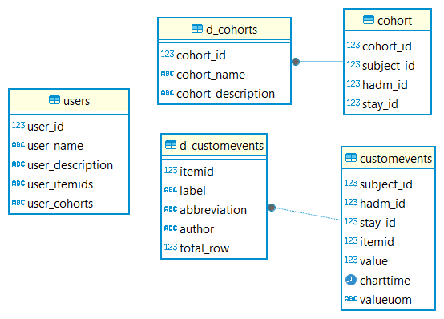

Extended usage for data-scientist
#################################

This application has been designed for a non-scientist usage. As the MIMIC-IV database is wide and complex, some part of the database are not covered by
MIMICWizard. This page is here to explain the internal design of the app so that any data-scientis from a research platform could extend the app.

Add new custom event to the application
***************************************
A User Interface has been developed to add custom event directly throught the application.
You can find this interface in the ``Developper settings`` panel.

From a CSV file
++++++++++++++++

You need to provide a event label, abbreviation and a csv (separator ``,``) including the following column :

+------------+---------+---------+-----------+-------+----------+
| subject_id | hadm_id | stay_id | charttime | value | valueuom |
+------------+---------+---------+-----------+-------+----------+

Directly from the database
+++++++++++++++++++++++++++

You can also add a new event directly from a table in the database from the menu ``Create custom events from database`` in the ``Developper settings`` panel.
You'll need to bind each column to the required fields.
If your table contains only stay_id or hadm_id, it can be automatically imputed using the checkboxs below the field selection.

Populate application with externally computed cohort
****************************************************

You can create a cohort externally to the app and use SQL to add this cohort to the app. You have to add a row with cohort information in the ``d_cohorts`` table and add a row by stay in the ``cohort`` table 

See the appendix below for query specification.

If you're not familiar with SQL or have issue with Postgres adapter in your favorite data science language, I recommend using `DBeaver Community Edition <https://dbeaver.io/_>`_ to explore and directly add data to the app database

Appendix : Application-related SQL schema to extend the app 
***********************************************************

      ER schema used by the app in the default public schema in postgres database. These table are used to persist user information when using the app

.. note:: If you're a data-scientist, a developper or any type of technical user and you've found nice way to upgrade the app, feel free to share your code in the Github repository !
    
    I would be really glad to see this application living and going further 🥳