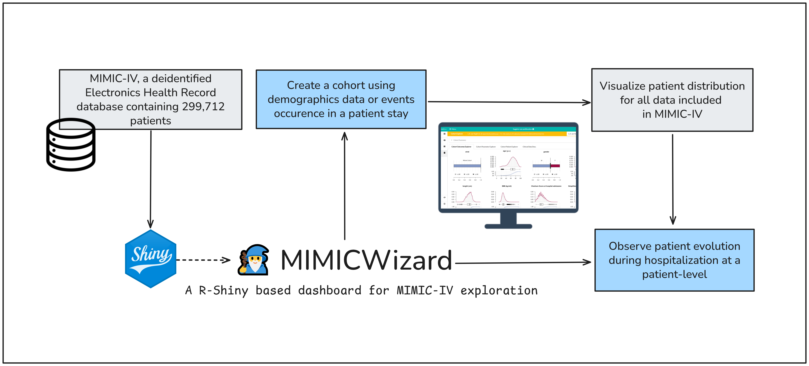

MIMICWizard Documentation
#########################

**MIMICWizard** is a Shiny app allowing user to navigate throught the PhysioNet MIMIC-IV database, a freely accessible deidentified electronic health record (EHR) dataset

Introduction
**************

The advent of Open-Access Electronic Health Records (EHRs) has revolutionized the landscape of clinical diagnosis and research. These digital versions of patient charts provide real-time, patient-centred records that provide precious information about patient state during its hospital stay.
However, the full potential of EHRs is yet to be realized due to two major constraints. 

First, access to patient databases is often restricted, limiting the scope of research and analysis. Second, there exists a significant technical barrier for non-technical users who wish to explore these databases but lack the necessary data science skills. 

Initially designed for medical practitioner, it offer a tool to help drawing and exploring new hypothesis. 

Installation Requirements
*************************

MIMIC-IV database is under restricted access. User should follow a training about patient data management and sign an agreement to access the data.
That's why MIMICWizard is offering the possibilitiy to use demo database which contain only 100 patients but could showcase the app features.

**Requirements** 

* PostgreSQL v15 (or greater)
* R version 4.4
* MIMIC-IV Clinical Database files `demo file <https://physionet.org/content/mimic-iv-demo/>`_ or request a `full access <https://mimic.mit.edu/docs/gettingstarted/>`_

.. warning::

   MIMICWizard has been developped to work with a Postgres database. The application is not intented to be compatible with BigQuery or other proprietary solution.

You can follow the installation instructions on the getting started page.

Changelog
*********
.. image:: https://github-readme-stats.vercel.app/api/pin/?username=biomerieux-open-sources&repo=mimicwizard
   :target: https://github.com/biomerieux-open-sources/mimicwizard
   :alt: MIMICWizard GitHub Card

* **v0.7.1 (2025-06-27)** : Bugfixes and optimization
* **v0.7.0 (2025-06-20)** : Public release associated with online demo version
* **v0.6.4 (2025-03-13)** : Initial public release

|pic1|
   .. |pic1| image:: assets/Logo_LCR.png
      :height: 90px
      :class: no-scaled-link
      :alt: Laboratoire Commun de Recherche - HCL-bioMérieux

Research and development team
*****************************

This application was originally developed by the Common Research Laboratory of Edouard Herriot Hospital (Laboratoire Commun de Recherche - HCL-bioMérieux, Lyon, France).

This is not an official bioMérieux or Hospices Civils de Lyon product. The application is provided as is without any warranty.

The app is provided under open-source GNU GPLv3 licence. All contributions and suggestions are welcome. Learn more about contribution in our dedicated GitHub page.

.. seealso::

   You can read more about MIMICWizard project in our dedicated research paper 

   TBA
   

References and data
*******************

Read about MIMIC-IV database and Physionet repository used in MIMICWizard

MIMIC-IV Clinical Database (version 2.2)
++++++++++++++++++++++++++++++++++++++++
   Johnson, A., Bulgarelli, L., Pollard, T., Horng, S., Celi, L. A., & Mark, R. (2023). MIMIC-IV (version 2.2). PhysioNet. https://doi.org/10.13026/6mm1-ek67.

MIMIC-IV Clinical Database Demo (version 2.2)
+++++++++++++++++++++++++++++++++++++++++++++
   Johnson, A., Bulgarelli, L., Pollard, T., Horng, S., Celi, L. A., & Mark, R. (2023). MIMIC-IV Clinical Database Demo (version 2.2). PhysioNet. https://doi.org/10.13026/dp1f-ex47.
   
MIMIC-IV Clinical Database Publication
+++++++++++++++++++++++++++++++++++++++
   Johnson, A.E.W., Bulgarelli, L., Shen, L. et al. MIMIC-IV, a freely accessible electronic health record dataset. Sci Data 10, 1 (2023). https://doi.org/10.1038/s41597-022-01899-x

PhysioNet Publication
+++++++++++++++++++++
   Goldberger, A., Amaral, L., Glass, L., Hausdorff, J., Ivanov, P. C., Mark, R., ... & Stanley, H. E. (2000). PhysioBank, PhysioToolkit, and PhysioNet: Components of a new research resource for complex physiologic signals. Circulation [Online]. 101 (23), pp. e215–e220.

.. toctree::
   :maxdepth: 3
   :hidden:
   
   index